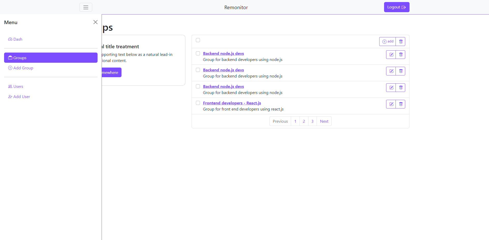

# :book: Remonitor Project.

Remonitor is a service to allow an admin to monitor multiple groups of devices (examples: employees, students and children). The service enables the admin to get user's device usage stats, login logout times and screenshots of the device screen at set intervals for monitioring.

## Project setup.
### Setup backend.
1. Deploy node.js backend in AWS Lambda and configure DynamoDB. Backend code can be obtained in the repo; [server backend](https://github.com/MosesSoftEng/remonitor-backend-aws.git).
2. Create DynamoDB databases.

### setup frontend.
1. Deploy node.js backend in AWS S3. Backend code can be obtained in the repo; [admin frontend](https://github.com/MosesSoftEng/remonitor-admin-front.git).
2. Configure the frontend to link with the backend.
3. Access the app and create an account.
4. Create a group and add a user, user credentials will be auto generated.

### Setup client.
Download the client desktop application and login with users credentials generated in backend setup.

## Licensing
No license to use the project as a client. Lincense required for project usage as admin.

# :man: Author and Credits.
This project was done by [SE. Moses Mwangi](https://github.com/MosesSoftEng). Feel free to get intouch with me;

:iphone: WhatsApp [+254115227963](https://wa.me/254115227963)

:email: Email [moses.soft.eng@gmail.com](mailto:moses.soft.eng@gmail.com)

:thumbsup: A lot of thanks to [ALX-Africa Software Engineering](https://www.alxafrica.com/) program for the project requirements.